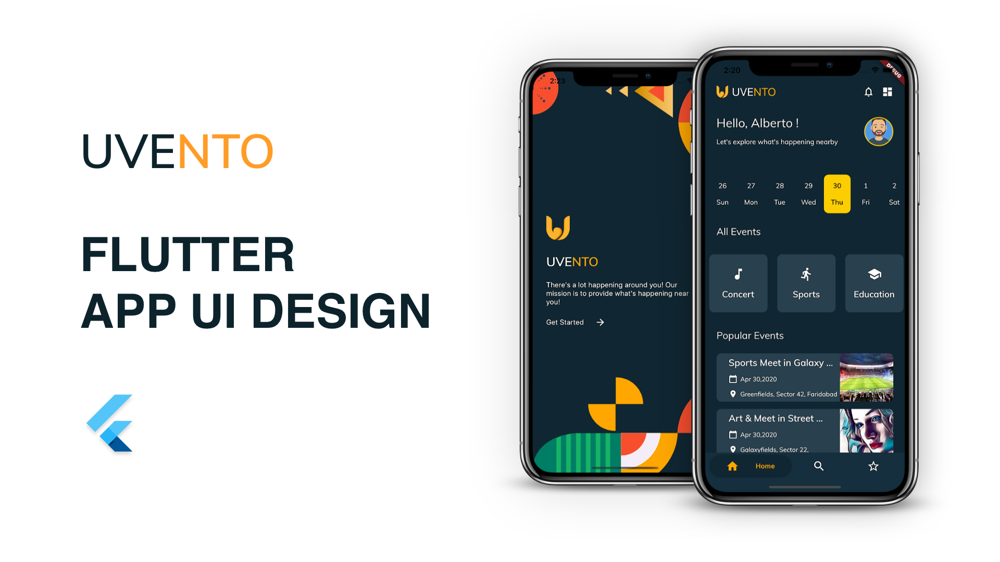

# Uvento 

This ui and ux provide a mock app to discover upcoming events near you and get personalized recommendations
 Made with Flutter 

 

&nbsp;&nbsp;&nbsp;&nbsp;&nbsp;&nbsp;&nbsp;&nbsp;&nbsp;&nbsp;&nbsp;&nbsp;

UI Designer [credits](https://dribbble.com/shots/9519342-UVENTO-App-Event-app-Exploration)
